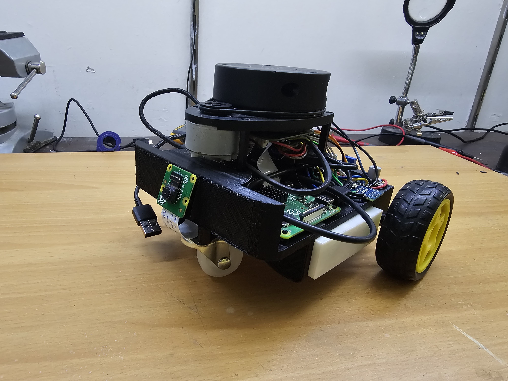

# Articubot_one

This repository is a fork of Josh Newans Articubot_one, with customizations to make the design more compact and easy to print, It can be 3d printed as a single piece and requires minimal screws. It is based on a rasberry pi 4,rasberry pi cam, arduino nano, n20 encoder motors, L298N and a 3d printed power bank with a buck converter to power the motors.
The following is the 3D model for this particular design:
https://www.thingiverse.com/thing:6423686

This is the playlist: https://www.youtube.com/playlist?list=PLunhqkrRNRhYAffV8JDiFOatQXuU-NnxT

Josh Newans github: https://github.com/joshnewans

You may need to change the counts per revolution of the motors in the description files because each motor is different, to do that use the following tutorial: 
https://www.youtube.com/watch?v=-PCuDnpgiew&list=PLunhqkrRNRhYAffV8JDiFOatQXuU-NnxT&index=7




## Installing ROS
Follow the instructions to install ROS foxy on both the dev machine and the robot:
https://docs.ros.org/en/foxy/Installation.html

## Making the workspace
Do the following on both your dev machine and your robot(rasberry pi):

```bash
mkdir robot_ws
cd robot_ws
mkdir src
cd src
```

git clone the package here

```bash
git clone https://github.com/FaizanTabassum/articubot_one.git
cd ..
colcon build
```
## Arduino firmware for motor control
https://github.com/joshnewans/ros_arduino_bridge

## Dependencies

Before proceeding, ensure that you have the following dependencies installed:

- **ROS 2 Foxy Fitzroy Packages:**
  ```bash
  sudo apt install ros-foxy-rviz2
  sudo apt install ros-foxy-gazebo-ros-pkgs
  sudo apt install ros-foxy-gazebo-ros2-control
  ```

- **Raspberry Pi Support for lidar:**
- install this on the rasberry pi
  ```bash
  sudo apt install ros-foxy-rplidar-ros
  ```

- **Joystick and Control Packages:**
  ```bash
  sudo apt install joystick jstest-gtk evtest
  sudo apt install ros-foxy-twist-mux
  ```

- **SLAM Toolbox and Navigation2:**
  ```bash
  sudo apt install ros-foxy-slam-toolbox
  sudo apt install ros-foxy-navigation2 ros-foxy-nav2-bringup
  ```

- **Serial Communication Packages:**
  ```bash
  sudo apt install python3-serial
  ```

- **Additional Packages:**
  ```bash
  sudo apt install ros-foxy-image-transport-plugins
  sudo apt install ros-foxy-rqt-image-view
  ```

- **clone this in the src file to test the serial port with the arduino:**
  ```bash
  git clone https://github.com/joshnewans/serial_motor_demo.git
  ```

## Usage (These are just the generally confusing commands)
### Main commands
To launch the robot, use the following command on the robot:
```bash
cd robot_ws/
source install/setup.bash 
ros2 launch articubot_one launch_robot.launch.py
```
To launch the lidar, use the following command:
```bash
cd robot_ws/
source install/setup.bash 
ros2 launch articubot_one rplidar.launch.py
```
To launch the camera, use the following command:
```bash
cd robot_ws/
source install/setup.bash 
ros2 launch articubot_one camera.launch.py
```

### Mapping

To perform mapping, use the following command and also open Rviz and add the map tile and ented /map as a topic:
```bash
ros2 launch slam_toolbox online_async_launch.py params_file:=./src/articubot_one/config/mapper_params_online_async.yaml use_sim_time:=false
```

### Navigation

For navigation, open rviz2 add a map tile and select /global_costmap as a topic and use the 2d pose goal to make the robot go wherever:
```bash
ros2 launch nav2_bringup navigation_launch.py use_sim_time:=false
```

### Teleoperation (Keyboard)

To use the teleop keyboard, run the following command on the dev machine:
```bash
ros2 run teleop_twist_keyboard teleop_twist_keyboard --ros-args -r /cmd_vel:=/diff_cont/cmd_vel_unstamped
```
### Joystick

To launch the joystick program, run on the dev machine:
```bash
ros2 launch articubot_one joystick.launch.py
```

### Rviz2

To open Rviz2 with config file , run on the dev machine:
```bash
rviz2 -d src/articubot_one/config/main.rviz
```

## The URDF file

This program's URDF file is eddited according to my design, It is designed to be compact and easy to print and assemble, the whole print is just one piece and has place holders for all the components.
